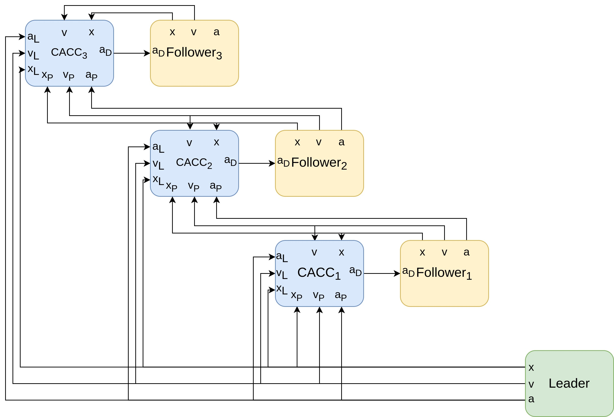
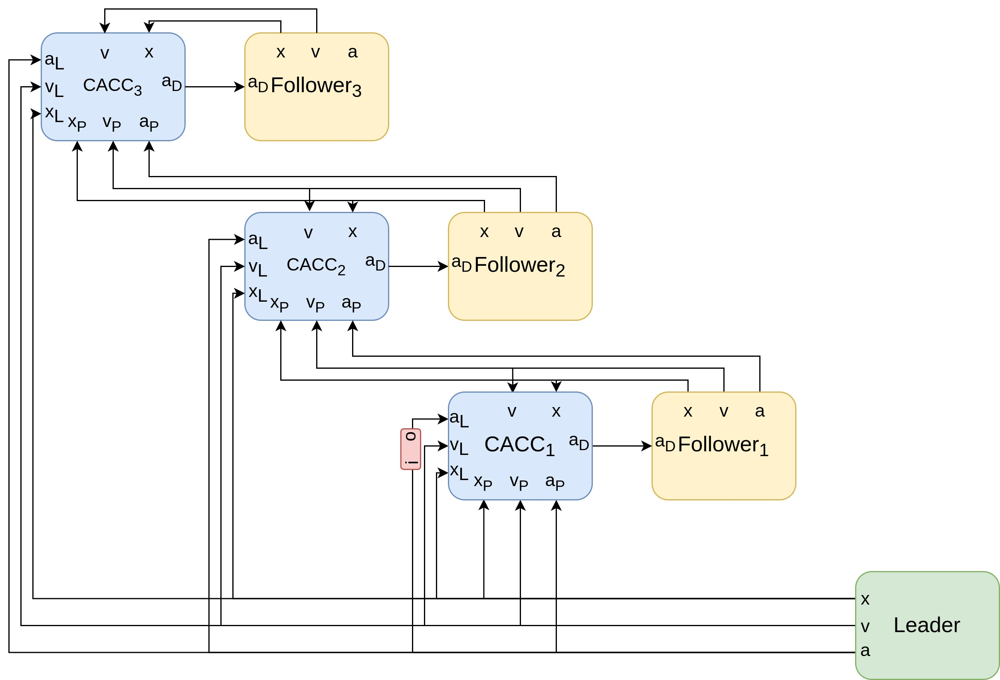
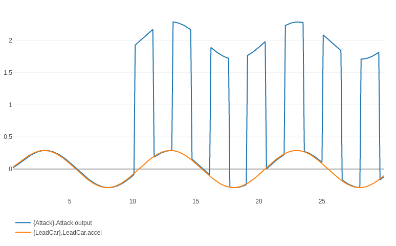
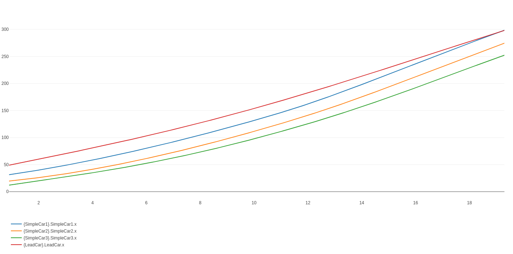
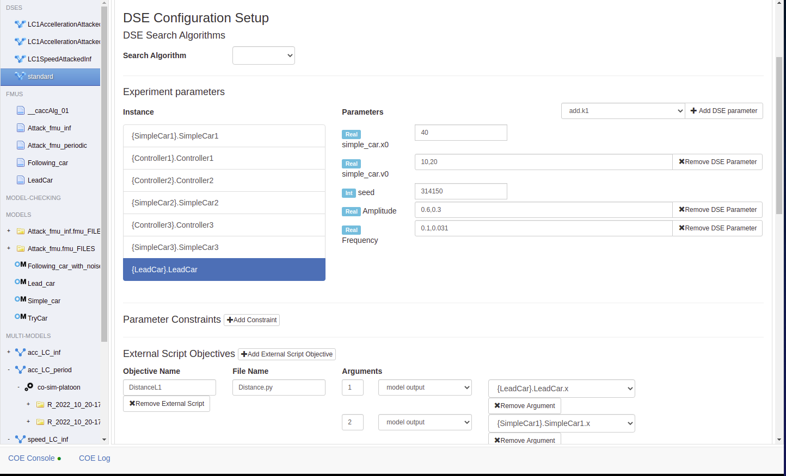
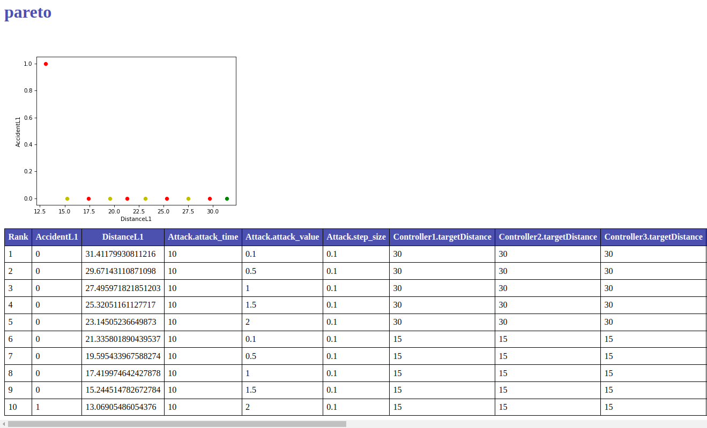

# Attack analysis on vehicles platoon
This project provides a simple and ready-to-use example of terrestrial vehicles platoon.
## Requirements
 1. Linux-like OS (currently tested on Ubuntu 16 and Ubuntu 20)
 2. INTO-CPS Application, downloadable [here](https://into-cps-association.github.io/download/)
## Standard Scenario

In the pre-built project we have the "standard platooning" multi-model with 3 following cars and a leading car.
The plant of every car has been modeled in OpenModelica (models can be found in the "Models" folder) while the control algorithm is the Cooperative Adaptive Cruise Control (CACC), which establishes a fixed distance between the cars and guarantees "string stability" i.e. perturbations at the head of the platoon smoothly propagates to the tail.

## Attacked scenarios

In the prebuilt project there are also 3 MultiModels that include a data alteration attack:
1. in  "acc_LC_inf" an attack FMU alters the acceleration from the leader to the first following car, increasing the value by 2 m/s^2 starting from time 10. The resulting architecture is shown in 
2. in "acc_LC_period" an attack FMU alters the acceleration from the leader to the first following car, periodically increasing the value by 1 m/s^2 starting from time 10. The attack is shown in 
3. in  "speed_LC_inf" an attack FMU alters the speed from the leader to the first following car, increasing the value by 14 m/s starting from time 10. It is possible to see that at time 19.2 the following car overtakes the lead car, which means that the cars crashed.

## DSE
In the "userMetricScripts" folder there are 2 scripts that can be used to evaluate different objective functions for the DSE analysis:
1. Accident.py takes as input two subsequent cars and returns 1 if the 2 cars crash into each other 0 otherwise
2. Distance.py takes as input two subsequent cars and return the distance averaged throughout the simulation

These scripts have been used to create 4 DSE scenarios:
1.  1 for the evaluation of the platoon behaviour in the "standard" behaviour, i.e. without attacks where it is possible to vary the parameters of the leading car to see how they affect the stability of the platoon and if they produce a crash.

2. 1 for each attack scenarios where the it is possible to vary the attack value and the target distance of the control algorithm to find which combinations lead to a crash.

## Instructions for co-simulation

  1. Launch the INTO-CPS application and open the `platoon` project

 2. If not already done, download the coe from the download manager of the INTO-CPS application (this is a one time only operation)

 3. Expand any Multi-Model (+ button) and open the `co-sim` scenario

 4. Launch the COE and then start the simulation

# Contacts

For futher information contact Maurizio Palmieri at maurizio.palmieri@ing.unipi.it

