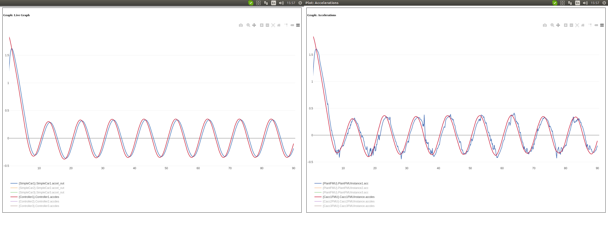
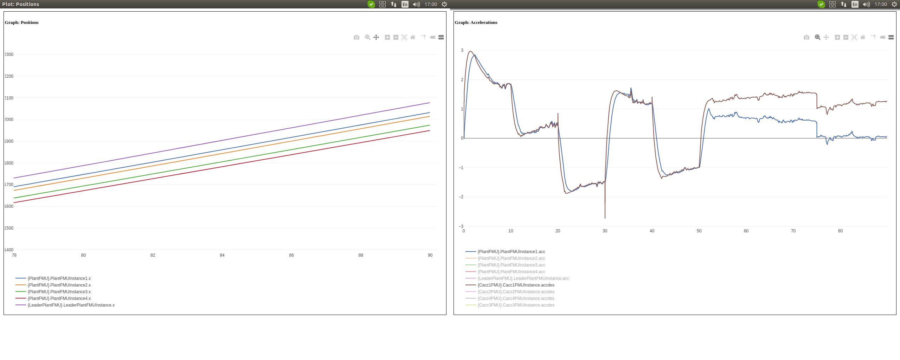

# Vehicles platoon
This repository provides a simple and ready-to-use example of terrestrial vehicles platoon based on OpenModelica and C code.
## Requirements
 1. Linux-like OS (currently tested on Ubuntu 16 and Ubuntu 20)
 2. INTO-CPS Application, downloadable [here](https://into-cps-association.github.io/download/)
## Scenario

In the pre-built project "platoon" we have the "standard platooning" multi-model with 3 following cars and a leading car.
The plant of every car has been modeled in OpenModelica (models can be found in the "Models" folder) while the control algorithm is the Cooperative Adaptive Cruise Control (CACC), which establishes a fixed distance between the cars and guarantees "string stability" i.e. perturbations at the head of the platoon smoothly propagates to the tail.

## DSE
In the "userMetricScripts" folder there are 2 scripts that can be used to evaluate different objective functions for the DSE analysis:
1. Accident.py takes as input two subsequent cars and returns 1 if the 2 cars crash into each other 0 otherwise
2. Distance.py takes as input two subsequent cars and return the distance averaged throughout the simulation

These scripts have been used for the evaluation of the platoon behaviour varying the parameters of the leading car to see how they affect the stability of the platoon and if they produce a crash.

## Instructions for co-simulation

  1. Launch the INTO-CPS application and open the `platoon` project

 2. If not already done, download the coe from the download manager of the INTO-CPS application (this is a one time only operation)

 3. Expand any Multi-Model (+ button) and open the `co-sim` scenario

 4. Launch the COE and then start the simulation

 
 # Platoon with models of vehicle's dynamics
This repository also provides a version of the platoon where the cars's dynamics are modeled with Simulink and it is possible to evaluate the impact of different weather conditions. 
The models are taken from “S. Pedone, A. Fagiolini, Racecar Longitudinal Control in Unknown and Highly-Varying Driving Conditions. IEEE Trans. on Vehicular Thechnology, 69(11), 12521-12535” available [here](https://ieeexplore.ieee.org/document/9189783)
## Requirements
 1. Linux-like OS (currently tested on Ubuntu 16 and Ubuntu 20)
 2. INTO-CPS Application, downloadable [here](https://into-cps-association.github.io/download/)
 3. MATLAB version 2021a 
## Scenario Comparions

In the pre-built project "platoon_with_dynamic_car_model" we have the "PlatoonSine" multi-model with 3 following cars and a leading car.
The plant of every follower car has been modeled in Simulink (models can be found in the "Models" folder) while the leader car is still modeled with OpenModelica.
The platoon algorithm is, again, the CACC algorithm.

It is possible to use this Multi-Model to execute a co-simulation with the same conditions of the simple scenario in order to compare the two models.

## Weather condition
In the pre-built project "platoon_with_dynamic_car_model" we have the "Platoon" multi-model with 4 following cars and a leading car.
The plant of every car has been modeled in Simulink.

It is possible to use this Multi-Model to execute a co-simulation with different weather conditions and evaluate how the cars behave with different road conditions: dry, wet, snowy and icy.
In particular we can see an example where the road is dry until time 25 seconds, wet until time 50 seconds, snowy until 75 seconds and then icy till the end.
 

## Instructions for co-simulation

  1. Launch the INTO-CPS application and open the `platoon_with_dynamic_car_model` project

 2. If not already done, download the coe from the download manager of the INTO-CPS application (this is a one time only operation)

 3. Expand any Multi-Model (+ button) and open the `co-sim` scenario

 4. Launch the command "./fmu-matlab-setup 6" from the MATLAB folder "toolbox/shared/fmu_share/script"

5. Launch the COE from terminal with the command "java -jar coe.jar" from the "install_download" folder of into-cps and then execute the co-simulation
NOTE: the first execution will require more time to initialize.

# Contacts

For futher information contact Maurizio Palmieri at maurizio.palmieri@ing.unipi.it

